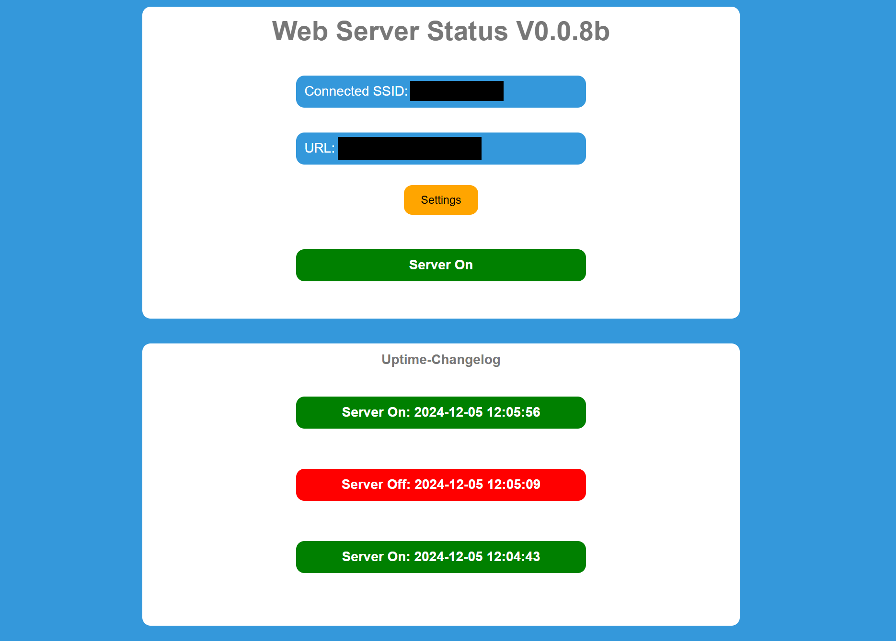
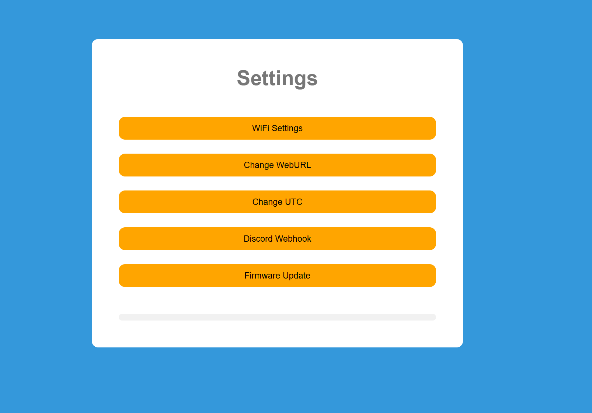

# esp32-web-server-status
Turn your esp32 to a uptime checker.

1. Upload the latest .bin file to your ESP32.
2. The ESP32 listens to the SSID: hotspot123321 and password: pw123456. Turn on a hotspot with these credentials and access your ESP32 via the web browser from the hotspot device. Go to the settings and change the WiFi settings.
3. Now your ESP32 should connect to your home network. Go back to the web interface of your ESP32 and enter a server URL to check its availability.
4. To receive a notification when the server status changes, you can enter a Discord webhook or ntfy.sh URL.

