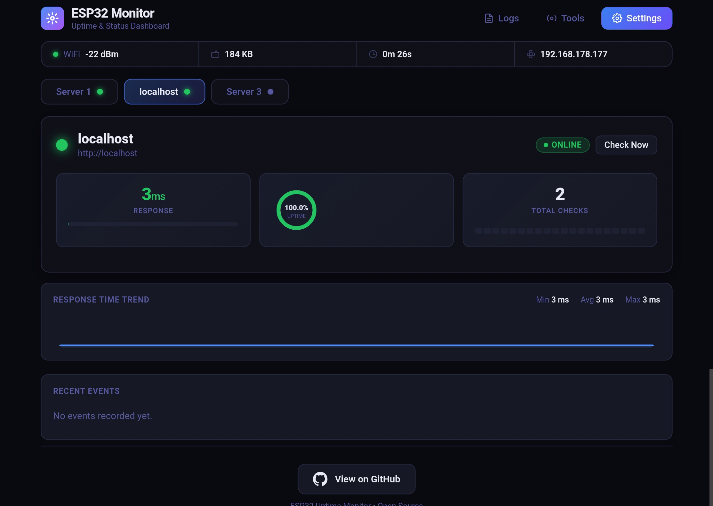

# ESP32 Uptime Monitor

Turn your ESP32 into a simple, powerful, and standalone uptime monitor. Monitor up to **10 independent servers or websites** and receive instant, configurable notifications if one of them goes down.



---

## Features

- **Monitors up to 10 independent servers/websites**
- Modern, responsive web interface with live status updates
- **Tabbed Dashboard** — scrollable tab row with status indicator per server
- **Real-Time System Bar** — IP address, WiFi RSSI, free heap and device uptime at a glance
- **Per-Server Event Log** — shows ONLINE/OFFLINE history with date and time per server
- **Central System Log** — logs boot reason, WiFi events, server state changes and RAM warnings
- **RAM Monitoring** — automatic warnings in the system log when free heap drops below 150 / 100 / 50 / 30 KB
- **Accurate Ping Measurement** — TCP connection test for true network round-trip time, no TLS overhead
- **Ping History & Charts** — SVG sparkline chart with last 20 ping values, plus min/max/avg and uptime ring per server
- **Multiple Notification Platforms:**
  - Discord (via Webhook)
  - Ntfy (with priority settings)
  - Telegram (via Bot, up to 3 Chat IDs per server)
- **Custom HTTP Actions** — trigger custom URLs (IFTTT, Home Assistant, etc.) on online/offline events per server
- **WiFi Network Scan** — browse available networks directly from the settings page
- **Manual Check Trigger** — force an immediate status check for any server with one click
- **Port Scanner** — scan ~85 common ports on any host directly from the web interface (with disclaimer)
- **OTA Firmware Updates** — update firmware through the web interface
- **Persistent Settings** — all configuration saved in ESP32 flash (Preferences/NVS)

---

## Getting Started

### 1. Flash the Firmware

Upload the latest `.bin` file to your ESP32 via the web updater, or flash the source code using the Arduino IDE.

> **Note (source code):** Place both `source-code-Vxx.ino` and `html.h` inside the **same sketch folder**. The Arduino IDE will not compile correctly if `html.h` is missing.

### 2. Initial WiFi Setup

On first boot, or after a factory reset, the ESP32 will try to connect to its preconfigured default network. **Create a mobile hotspot on your phone or computer** with the following credentials:

- **SSID:** `hotspot123321`
- **Password:** `pw123456`

The ESP32 will connect to this hotspot. Find its IP address in your hotspot's client list or via the Arduino Serial Monitor. Open that IP in your browser, click **Settings**, go to the **WiFi** tab, enter your home WiFi credentials and click **Save & Restart**.

### 3. Configure Your Servers

Once connected to your network, find the ESP32's IP in your router's client list or via the Arduino Serial Monitor.

- Open the IP in your browser and click **Settings**
- Each server has its own tab (S1–S10)
- Set the URL to monitor, check interval, fail/recover thresholds and notification settings
- Set the URL to `0` to disable a server slot

---

## Important Notes

### Settings Reset on Update

Each firmware version has an internal version number. When you update the firmware, the device detects the version change and **automatically resets all saved settings to defaults**. This prevents conflicts with outdated configurations.

**You will need to re-configure your WiFi and server settings after every firmware update.**

### Manual Factory Reset

If you get locked out (e.g. wrong WiFi credentials), hold the **BOOT button** for **5 seconds** while the device is starting. The device will wipe all settings and restart with default configuration.

### Hardware Requirements

- Any ESP32 with **4 MB flash** — no PSRAM required
- Tested on: ESP32-WROOM-32, M5Atom S3

---

## Port Scanner

The built-in port scanner (found under **Tools → Port Scanner**) scans ~85 common TCP ports on a target host and generates a report of open ports with service names.

> ⚠ **Use responsibly.** Only scan servers you own or have explicit permission to scan. Unauthorized port scanning may be illegal in your country.

---

## File Structure

```
ESP32-Uptime-Monitor/
├── src/
│   ├── source-code-Vxx.ino
│   └── html.h
├── bin/
│   ├── ESP32_webstatusVxx.bin
│   └── M5AtomS3_webstatusVxx.bin
├── README.md
└── LICENSE
```

---

## Contributors

- [PearXP](https://github.com/PearXP) — Author
- Claude (Anthropic) — AI-assisted development
